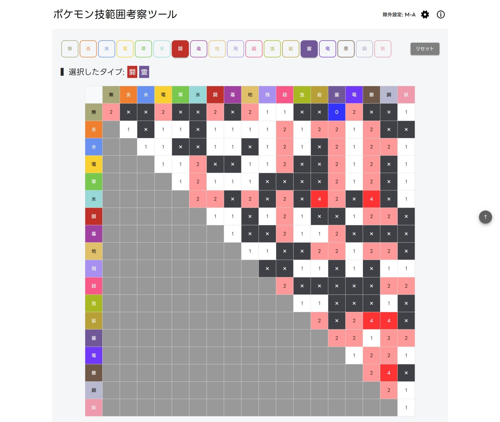
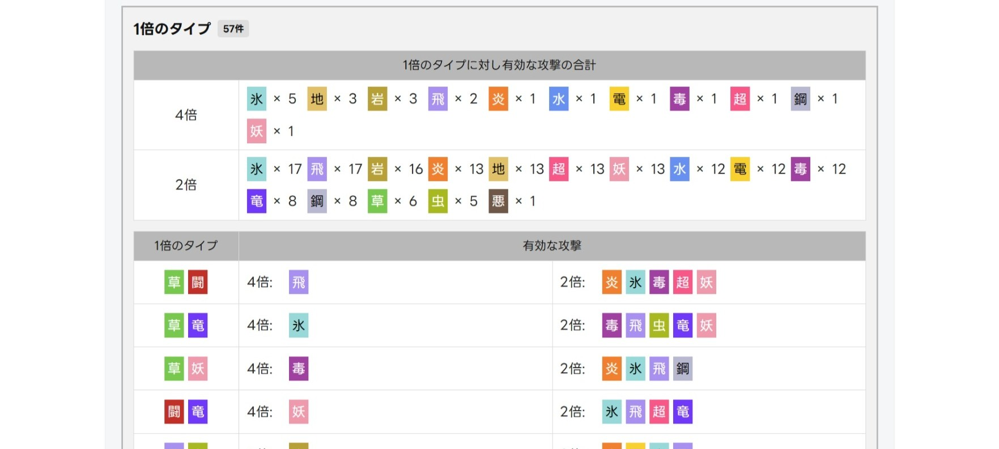

# ポケモン技範囲考察ツール
## 公開URL
https://suisui-swimmy.github.io/pokemon-type-coverage-tool/ 

## 機能

このツールは、選んだ攻撃タイプで各防御タイプに対して最大何倍のダメージを出せるかを一覧するための考察ツールです。

- 18タイプから攻撃タイプを複数選べます。
- フリーズドライ、フライングプレスなどの特殊な相性を持つ技も選べます。
- 単タイプ、複合タイプごとの最大倍率を表で確認できます。
- 今の攻撃範囲では弱点を突けない防御タイプを下部リストで確認できます。
- 弱点を突けない相手に対して、追加すると有効な攻撃タイプを確認できます。
- 実在しない防御タイプの組み合わせは、除外設定から非表示にできます。

## 表の見方

表の縦軸と横軸は、防御側のタイプです。

- 対角線上のマスは単タイプです。
- 対角線より片側のマスは複合タイプです。
- マスの数字は、選択中の攻撃タイプの中で一番高い倍率です。

## 下部リストの見方

表の下には、選択中の攻撃タイプでは弱点を突けない防御タイプ(1倍以下)がグループ表示されます。

各グループの中には、その相手に弱点を突ける追加候補が表示されます。

## 除外設定

画面右上の歯車アイコンから、除外タイプを設定できます。
除外した組み合わせは、表では黒地に「×」で表示されます。